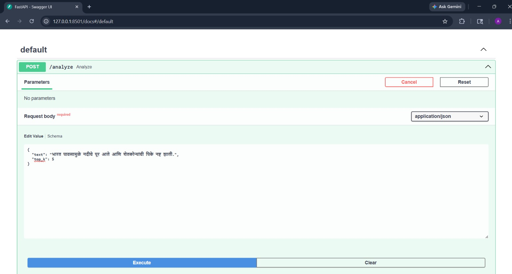
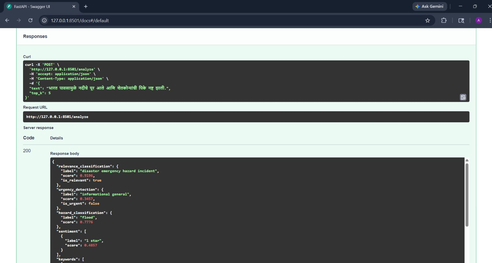

# ocean-hazard-detection-using-nlp-sih

## 📌 Project Overview

This project was developed as part of the **Smart India Hackathon (SIH)**, where I led the team and was responsible for designing and implementing the **Natural Language Processing (NLP) pipeline**.

The system focuses on analyzing disaster-related textual data (e.g., social media posts, reports) to detect hazards, assess urgency, and extract meaningful insights in real time. It aims to support authorities and organizations in making faster and more informed decisions during critical situations.

---

## ❓ Problem Statement

There is a need for a unified platform that enables citizens, coastal communities, volunteers, and disaster authorities to report real-time observations during hazardous ocean events while also monitoring public discourse through social media.

---

## ✅ Expected Solution

* **Multi-Level Analysis** – Relevance detection, urgency classification, and hazard identification
* **Real-Time Hazard Detection** – Detects floods, earthquakes, cyclones, fires, etc.
* **Urgency Prioritization** – Categorizes inputs into emergency, high priority, or informational
* **Relevance Filtering** – Eliminates noise and focuses on meaningful data
* **Advanced NLP Capabilities** – Sentiment analysis and Named Entity Recognition

---
## 🛠️ Tech Stack
* **Language**: Python
* **Framework**: FastAPI
* **Libraries**: Transformers, spaCy, KeyBERT
* **Models**: mDeBERTa-v3 (Multilingual Classification), Multilingual BERT (Sentiment Analysis)
* **Techniques**: Hazard Classification, Urgency Detection, Relevance Filtering, Sentiment Analysis, Named Entity Recognition (NER), Keyword Extraction
* **Tools**: Git, GitHub, Uvicorn

---

## 📊 Why Swagger UI?

Used for interactive API testing and documentation during development. It enables quick validation of endpoints without building a frontend and provides a clear interface for developers to understand and test the API.

---

## 🤖 NLP Models Used

### 1. Sentiment Analysis Model

```python
pipeline("sentiment-analysis", model="nlptown/bert-base-multilingual-uncased-sentiment")
```

**Why this model?**

* Supports **multiple languages**, including regional inputs
* Helps determine **emotional intensity and urgency**
* Useful for identifying distress signals in disaster-related text

---

### 2. Hazard Classification Model (Zero-Shot)

```python
pipeline("zero-shot-classification", model="MoritzLaurer/mDeBERTa-v3-base-mnli-xnli")
```

**Why this model?**

* Enables **zero-shot learning** (no retraining required)
* Can classify **unseen disaster types dynamically**
* Highly flexible for real-world, unpredictable inputs

---

## 💡 Our Solution Pipeline

The system processes input text through the following steps:

* Multilingual Input Handling
* Tokenization
* Keyword Extraction
* Hazard Classification
* Sentiment Analysis
* Named Entity Recognition

---

## 🚀 Innovative Features

* **Urgency Prioritization**
Categorizes inputs into emergency, high priority, or informational
* **Context-Aware Intelligence Layer**
Integrates sentiment, keywords, and classification for deeper insights
* **FastAPI Backend**
Scalable REST API (/analyze) for seamless integration
* **Testing Endpoint (/test)**
Enables quick validation and debugging
* **Robust Handling**
Ensures reliability through input validation and error handling
---

## 🌐 Multilingual Capability

The system supports **regional languages (e.g., Marathi, Bengali, Kannada)**, enabling:

* Wider accessibility
* Inclusion of local communities
* Better disaster reporting from grassroots levels

---

## 📸 Example Output (Marathi Input)




---




---

## 🎥 Demo Video


[Download / Watch Video](assets/demo.mp4)


---

## 🔮 Planned Enhancements

### NLP Improvements

* Lowercasing and normalization
* Spell checking and autocomplete
* Emoji handling
* Stemming/Lemmatization
* Stopword removal
* Language detection

### Data & Integration

* Integration with **Twitter and Facebook APIs**
* Location-based filtering using coordinates
* Coastal region bounding-box filtering

### Advanced Features

* Voice-to-text input
* Progressive Web App (PWA) for offline usage
* Auto-sync when internet is restored
* CSV export for analysis
* Data verification by officials

---

## 📈 Impact

* Empowers local residents to actively monitor hazards.
* Provides agencies actionable insights via maps, hotspots, and social media trends.
* Early identification of ocean anomalies enables timely interventions, minimizing damage.
* Enables authorities to counter misinformation on social media promptly.

---

## 👩‍💻 My Role

* Team Leader (SIH Project)
* Designed and implemented the **complete NLP pipeline**
* Integrated transformer-based models

---
